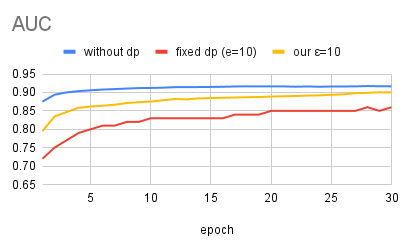
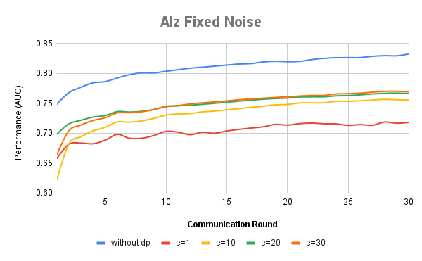
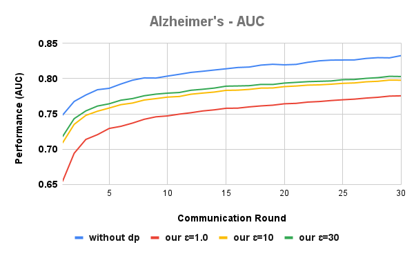

# MedShieldFL: Adaptive Differential Privacy for Federated Learning in Healthcare

This repository contains the implementation of **MedShieldFL**, a cutting-edge framework designed to enhance privacy in **Federated Learning (FL)** for healthcare applications. Federated Learning allows multiple institutions—like hospitals or clinics—to collaboratively train **machine learning models** without sharing sensitive patient data, such as medical images or records. However, even in FL, privacy risks remain: model updates (gradients) can unintentionally leak personal information, especially when data across institutions is **non-IID** (non-independent and identically distributed), meaning each site has unique data patterns, like varying disease prevalences or patient demographics.

Traditional **differential privacy (DP)** methods add uniform noise to all model updates to obscure sensitive info, but this often sacrifices model accuracy, as important details get drowned out. MedShieldFL solves this by introducing a **dual-adaptive noise injection** mechanism that smartly balances **privacy guarantees** with **model utility**. Here's how it works, broken down for clarity:

### Core Innovations
1. **Parameter Importance Adaptation**: Using the **Fisher Information Matrix (FIM)**—a mathematical tool that measures how much each model parameter influences predictions—MedShieldFL identifies "critical" parameters (those vital for accuracy) and applies less noise to them. Less important ones get more noise, protecting privacy without crippling performance. This is especially useful in heterogeneous healthcare data, where different institutions contribute varied insights.

2. **Gradient Convergence Adaptation**: As training progresses and the model stabilizes (gradients get smaller and more consistent), MedShieldFL gradually reduces noise levels. This minimizes disruptions in later stages, allowing the model to converge faster and more accurately while maintaining strong DP protections.

By dynamically calibrating noise based on these factors, MedShieldFL enforces rigorous **differential privacy** (quantified by privacy budgets like ε=1.0 for high privacy) without the pitfalls of fixed-noise approaches.

### Experimental Highlights
- **Datasets**: Evaluated on real-world medical benchmarks including **ISIC** (skin cancer imaging), **Alzheimer's disease** datasets (brain scans), and **Heart disease** records.
- **Performance**: Achieves up to 87.1% AUC at high privacy (ε=1.0), nearing non-private FL's 91.74%—a 7-11% boost over optimizer-based methods (e.g., FedAvg, FedAdam, FedAdagrad with fixed noise) and over 25% better than state-of-the-art like FedDPA.
- **Privacy Defense**: Effectively thwarts advanced **reconstruction attacks** (e.g., reconstructing original images from gradients), as shown in visual comparisons (reconstructed images and Structural Similarity Index).
- **Comparisons**: Outperforms baselines across privacy budgets, with no major optimizer differences in DP settings, highlighting the power of adaptive strategies.

### Why This Matters
For beginners: Imagine training an AI to detect diseases across hospitals without ever sending patient files—MedShieldFL makes it safer by adding "smart noise" that hides secrets but keeps the AI sharp.
For experts: This repo provides a robust, implementable solution to gradient leakage in non-IID FL, leveraging FIM for parameter-specific DP and convergence-aware scaling for optimized utility-privacy trade-offs.

### Results
#### 1. No Privacy vs Fixed Noise vs Our Method  

#### 2. Fixed Noise  

#### 3. Our Method  

